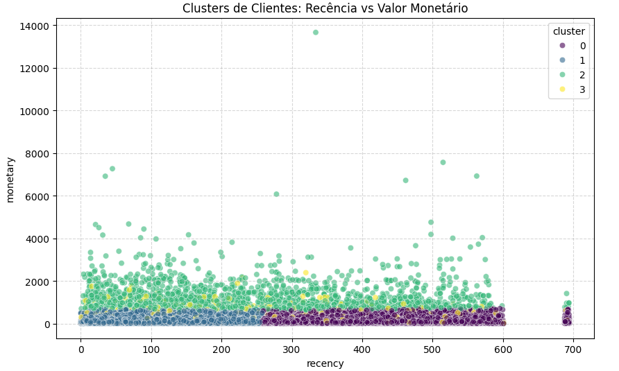

# 👥 Segmentação de Clientes - Modelo RFM

Este projeto aplica **Machine Learning (K-Means)** para agrupar +90k clientes da Olist em 4 perfis distintos de consumo.

## 🚀 Fluxo de Trabalho
1. **Engenharia de Atributos:** Extração de métricas comportamentais via SQL.
2. **Modelagem:** Normalização com `StandardScaler` e otimização de clusters via **Método do Cotovelo**.
3. **Análise de Clusters:** Identificação de grupos VIP, Clientes Recentes e Clientes em Risco.

## 📊 Visualização de Segmentos

